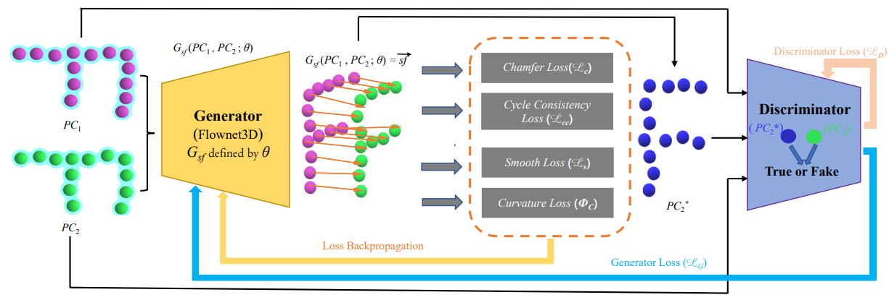

# SFGAN
### SFGAN: Unsupervised Generative Adversarial Learning of 3D Scene Flow from the 3D Scene Self

Created by Guangming Wang, <a href="[jck520 (github.com)](https://github.com/jck520)">Chaokang Jiang</a>, Zehang Shen and Yanzi Miao from Shanghai Jiao Tong University and China University of Mining and Technology.

### 

If you find our work useful in your research, please cite:

    @article{wang2021sfgan,
      title={SFGAN: Unsupervised Generative Adversarial Learning of 3D Scene Flow from the 3D Scene Self},
      author={Wang, Guangming and Jiang, Chaokang and Shen, Zehang and Miao, Yanzi and Wang, Hesheng},
      journal={Advanced Intelligent Systems},
      pages={2100197},
      year={2021},
      publisher={Wiley Online Library}
    }

### Abstract

Scene flow tracks the three-dimensional (3D) motion of each point in adjacent point clouds. It provides fundamental 3D motion perception for autonomous driving and server robot. Although the Red Green Blue Depth (RGBD) camera or Light Detection and Ranging (LiDAR) capture discrete 3D points in space, the objects and motions usually are continuous in the macro world. That is, the objects keep themselves consistent as they flow from the current frame to the next frame. Based on this insight, the Generative Adversarial Networks (GAN) is utilized to self-learn 3D scene flow with no need for ground truth. The fake point cloud of the second frame is synthesized from the predicted scene flow and the point cloud of the first frame. The adversarial training of the generator and discriminator is realized through synthesizing indistinguishable fake point cloud and discriminating the real point cloud and the synthesized fake point cloud. The experiments on Karlsruhe Institute of Technology and Toyota Technological Institute (KITTI) scene flow dataset show that our method realizes promising results without ground truth. Just as human, the proposed method can identify the similar local structures of two adjacent frames even without knowing the ground truth scene flow. Then, the local correspondence can be correctly estimated, and further the scene flow is correctly estimated.

### Installation

Install <a href="https://www.tensorflow.org/install/">TensorFlow</a>. The code is tested under TF1.9.0 GPU version, g++ 5.4.0, CUDA 9.0 and Python 3.5 on Ubuntu 16.04. There are also some dependencies for a few Python libraries for data processing and visualizations like `cv2`. It's highly recommended that you have access to GPUs.

#### Compile Customized TF Operators

The TF operators are included under `tf_ops`, you need to compile them first by `make` under each ops subfolder (check `Makefile`). Update `arch` in the Makefiles for different <a href="https://en.wikipedia.org/wiki/CUDA#GPUs_supported">CUDA Compute Capability</a> that suits your GPU if necessary.

### Usage

#### Flyingthings3d Data preparation

The data preprocessing scripts are included in `data_preprocessing`. To process the raw data, first download <a href="https://lmb.informatik.uni-freiburg.de/resources/datasets/SceneFlowDatasets.en.html">FlyingThings3D dataset</a>. `flyingthings3d__disparity.tar.bz2`, `flyingthings3d__disparity_change.tar.bz2`, `flyingthings3d__optical_flow.tar.bz2` and `flyingthings3d__frames_finalpass.tar` are needed. Then extract the files in `/path/to/flyingthings3d` such that the directory looks like

```
/path/to/flyingthings3d
  disparity/
  disparity_change/
  optical_flow/
  frames_finalpass/
```

Then `cd` into directory `data_preprocessing` and execute command to generate .npz files of processed data

```
python proc_dataset_gen_point_pairs_color.py --input_dir /path/to/flyingthings3d --output_dir data_processed_maxcut_35_20k_2k_8192
```

The processed data is also provided <a href="https://drive.google.com/file/d/1CMaxdt-Tg1Wct8v8eGNwuT7qRSIyJPY-/view?usp=sharing">here</a> for download (total size ~11GB).

#### Pretrained model on FlyingThing3D & Fine-tune the model on the KITTI dataset

```
log_train_best/model_latest.ckpt.meta   &    log_train_best/model_epe3d_929.ckpt.meta
```

#### Training

Pre-training the model on FlyingThing3D, the adjustable parameters include the data set path (--data), the loaded log (--log_dir), the number of points sampled from the point cloud (--num_point) and the training epoch (--max_epoch), etc. The command is as follows: 

```
nohup python train_gd.py --gpu 0 --model model_concat_upsa2 --data ../FlyingThings3D_subset_processed_35m --log_dir log_train_fly --num_point 2048 --max_epoch 1000 --batch_size 4 --pre_trained_dir log_train_best/model_latest.ckpt --gd_frequency 1 --weight_loss 1 > fly_logtrain.txt 2>&1 &
```

Fine-tune the model on KITTI. We release the processed KITTI scene flow dataset <a href="https://drive.google.com/open?id=1XBsF35wKY0rmaL7x7grD_evvKCAccbKi">here</a> for download (total size ~266MB). The KITTI scene flow dataset was processed by converting the 2D optical flow into 3D scene flow and removing the ground points. We processed the first 150 data points from KITTI scene flow dataset. Each of the data points are stored as a `.npz` file and its dictionary has three keys: `pos1`, `pos2` and `gt`, representing the first frame of point cloud, second frame of point cloud and the ground truth scene flow vectors for the points in the first frame. The first 100 frames are used to fine-tune the model.

```
nohup python train_gd_kitti.py --gpu 0 --weight_loss 100 --log_dir train_noshared --weight_g 2 --learning_rate_g 0.0001 --model model_concat_upsa2 --data_kitti ../../dataset/kitti_self_supervised_flow --num_point 2048 --max_epoch 1000 --batch_size 4 --pre_trained_dir log_train_best/model_latest.ckpt > noshared1.txt 2>&1 &
```

A pre-trained model is provided <a href="https://drive.google.com/open?id=1Ko25szFFKHOq-SPryKbi9ljpOkoe69aO">here</a> for download.

#### KITTI Evaluation


Set --max_epoch to 1 to perform model evaluation on KITTI. The last 50 frames are used to evaluate the model 

```
python train_gd_kitti.py --gpu 0 --weight_loss 100 --log_dir train_noshared --weight_g 2 --learning_rate_g 0.0001 --model model_concat_upsa2 --data_kitti ../../dataset/kitti_self_supervised_flow --num_point 2048 --max_epoch 1 --batch_size 1 --pre_trained_dir log_train_best/model_latest.ckpt > 
```

### Related Projects

* <a href="https://openaccess.thecvf.com/content_CVPR_2019/html/Liu_FlowNet3D_Learning_Scene_Flow_in_3D_Point_Clouds_CVPR_2019_paper.html" target="_blank">FlowNet3D Learning Scene Flow in 3D Point Clouds</a> by Liu et al. (CVPR 2019). Code and data released in <a href="[xingyul/flownet3d: FlowNet3D: Learning Scene Flow in 3D Point Clouds (CVPR 2019) (github.com)](https://github.com/xingyul/flownet3d)">GitHub</a>.
* <a href="http://stanford.edu/~rqi/pointnet" target="_blank">PointNet: Deep Learning on Point Sets for 3D Classification and Segmentation</a> by Qi et al. (CVPR 2017 Oral Presentation). Code and data released in <a href="https://github.com/charlesq34/pointnet">GitHub</a>.
* <a href="http://stanford.edu/~rqi/pointnet2" target="_blank">PointNet++: Deep Hierarchical Feature Learning on Point Sets in a Metric Space</a> by Qi et al. (NIPS 2017). Code and data released in <a href="https://github.com/charlesq34/pointnet2">GitHub</a>.

